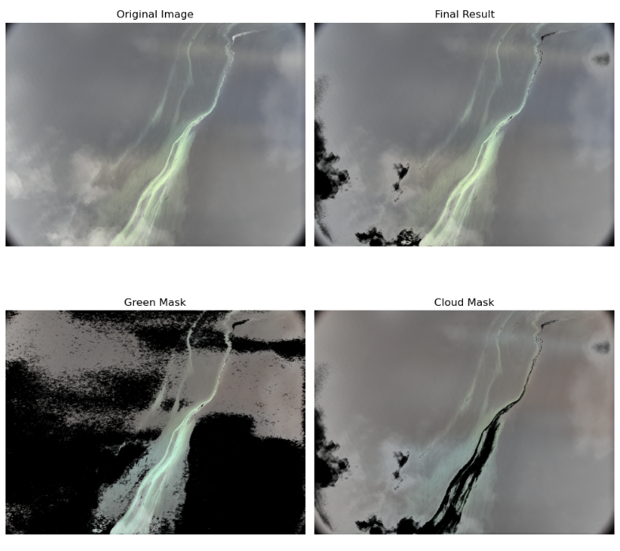

# cloud_removal
## Tool Overview:
This tool processes drone-captured images of water surfaces, removing cloud reflections while retaining green areas (such as algae or vegetation). It uses color segmentation and thresholding techniques to achieve this.

## Steps Involved:
1. **Green Area Segmentation**:
   - The image is converted to HSV (Hue, Saturation, Value) color space using `cv2.cvtColor`.
   - A mask is created to detect green regions in the image using predefined HSV values (`lower_green` and `upper_green`). This mask allows us to identify and retain vegetation or algae present on the water surface.
2. **Cloud Reflectance Detection**:
   - The original image is converted to grayscale for cloud detection.
   - A threshold is applied to detect the highly reflective cloud regions.
   - The mask is inverted to target non-cloud areas.
3. **Combining Masks**:
   - The green mask and cloud mask are combined to retain only the green areas and remove clouds.
   - The combined mask is applied to the original image to create the final processed result.
4. **Result Visualization**:
   - The output is displayed as a plot with four images:
     - **Original Image**: The raw drone image.
     - **Final Result**: The image after cloud removal and green area retention.
     - **Green Mask**: The mask highlighting the green areas identified.
     - **Cloud Mask**: The mask used to identify and remove clouds.
## Goal/Challenge:
The process of removing clouds using a simple threshold often results in the removal of many bright areas from the image, leading to catastrophic loss of information and making it impossible for the computer vision model to clearly identify the phenomenon of interest.

To mitigate this, the process was divided into a two-step approach:
1. **Cloud Removal Using Threshold**: This step removes the bright cloud regions using a specified threshold value.
2. **Identifying and Retaining the Phenomenon**: In the second step, careful identification of green areas helps retain the phenomenon of interest (such as algae or vegetation on the water surface). This segmentation ensures that important information is preserved in the image.

Careful parameter fine-tuning was required for the second step to ensure the complete phenomenon was included, without losing critical details.

This approach helps analyze water surfaces by eliminating cloud reflectance while keeping algae or vegetation intact for further assessment.
